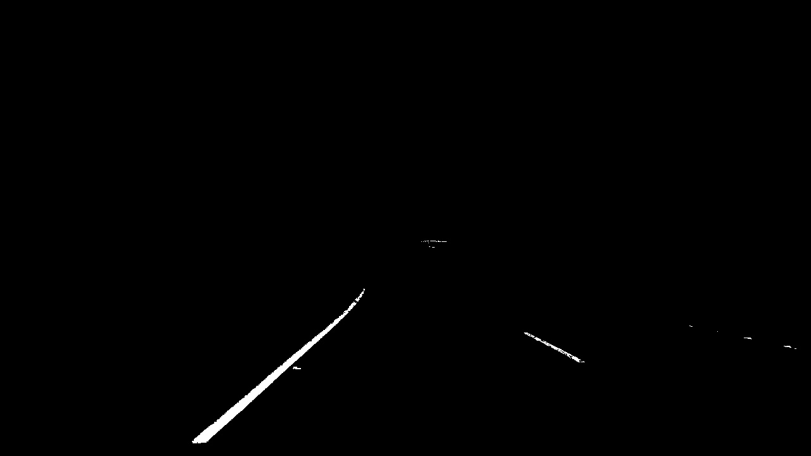
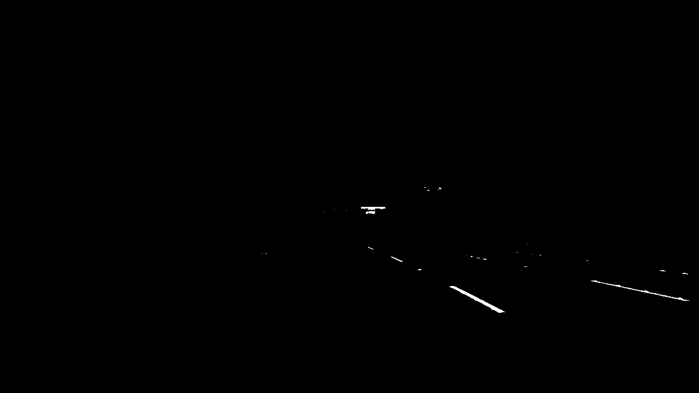
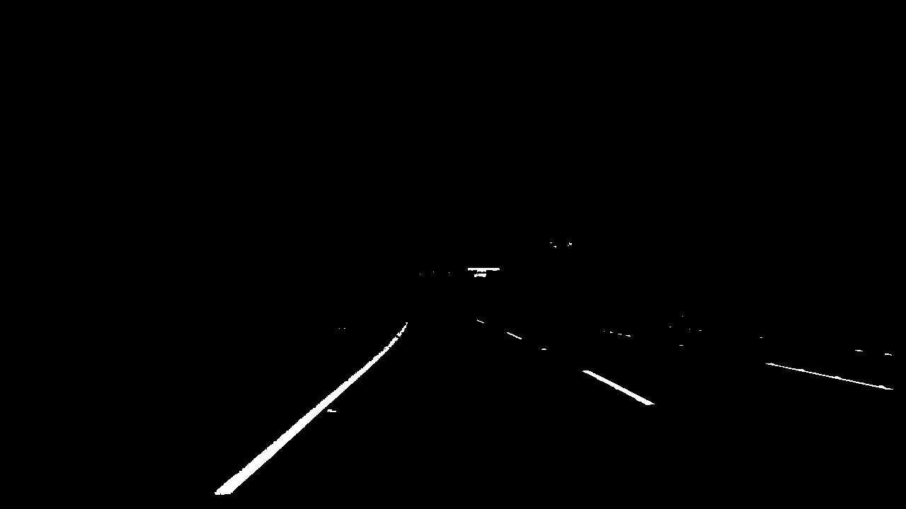
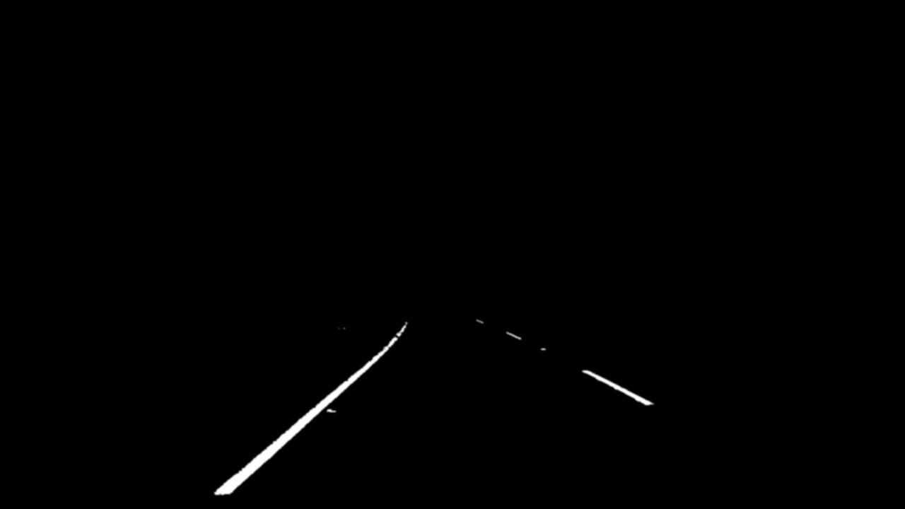
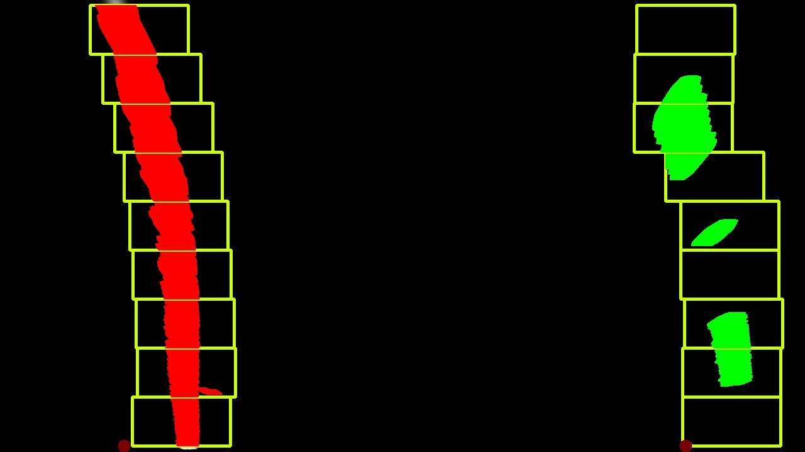
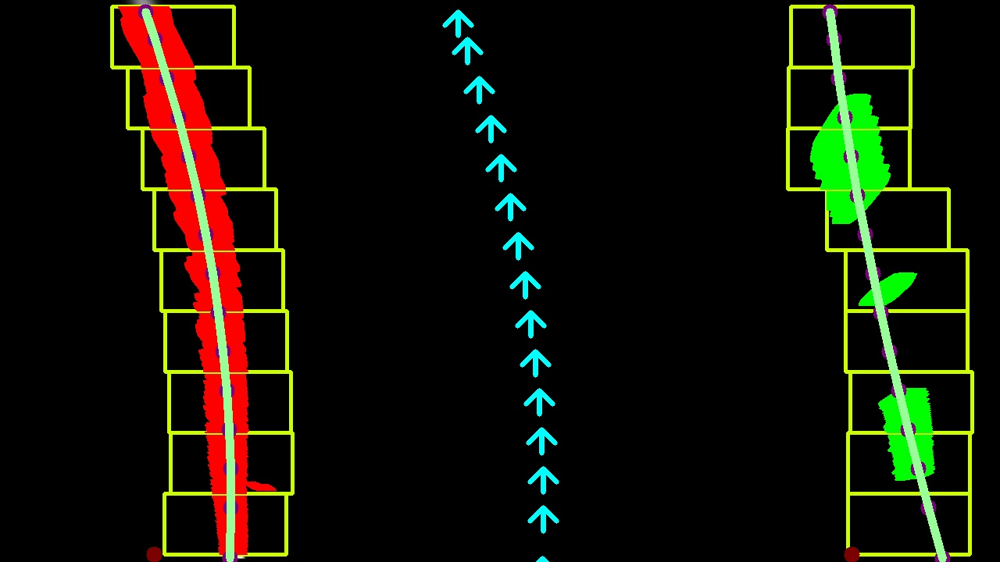
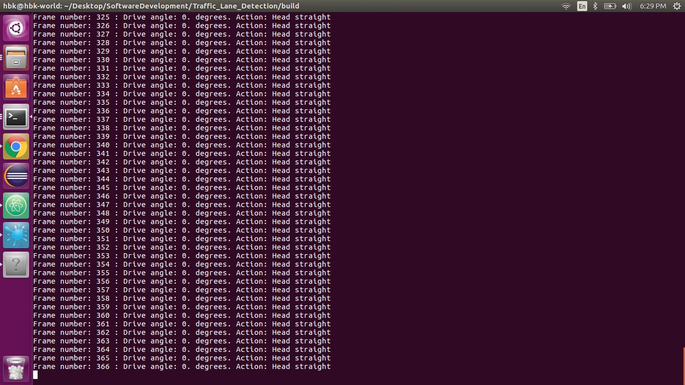
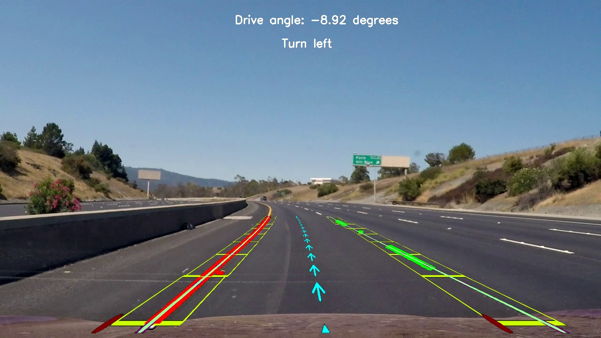

# Smart Lane - A Traffic Lane Detection System
[](https://travis-ci.org/harshkakashaniya/Traffic_Lane_Detection) [](https://coveralls.io/github/harshkakashaniya/Traffic_Lane_Detection?branch=master) [](https://github.com/harshkakashaniya/Traffic_Lane_Detection/blob/master/LICENSE)
---

## Overview

Lane detection is an important aspect of self-driving vehicles. With   Acme   robotics   entering   the   autonomous   delivery   business,  delivery   vehicles   should   be   smart   enough   and   able   to   navigate   roads  effortlessly. Smart Lane is a lane detection module that can be integrated with the other modules onboard a self driving car. This project has been developed as a part of the ENPM808X-Software Development course for midterm project. 

A quick overview of the algorithm is as follows:

- Filter   and   segment   the   input   image   to   get   a   rough   estimate   of   the  lanes.
- Perform region of interest (ROI) extraction for filtering out false positives.
- Perspective transformations for getting lane slopes and curves.
- Overlay lane lines and calculate heading direction to output.
- Provides display of DriveHeading to the actuator to move in right, left, or straight. 
- Output is an video which will show the area inside the lane and will assist controller to move the mechanism to right or left.
 
## Algorithm Process and Output Results 

This software project enables us to use data from camera of any car and provide lane assistance to the controller. It takes in colorful image of road and surrounding. And provides output of turning angle, lane detection and turning side. It takes input image as follows.
## INPUT IMAGE


This input frame is first undistorted. Later this image processes the yellow lane on the left by converting whole image into HSV (to reduce effect of change in ambient light). Then it takes in yellow color values. With which it compares values of all pixels in the image. And we get the following output.
## YELLOW THRESHOLD IMAGE


Additionally, we convert original image to grayscale image and then find white lane. Output of white lane is shown below.
## WHITE THRESHOLD IMAGE


We merge both the images and get resultant image. Now if we define our region of interest we will be able to eliminate noise above lower half. This is be the fact that lane can not go above half the area.
## COMBINED IMAGE


And finally, after getting points we plot polygon curves where other elements of matrix(Mask matrix) are zero and elements under polygon are 1's To get our desired Region of interest we do bitwise_And so that final matrix will have white elements inside the ROI only. So final output of a frame will be as shown.
## COMBINED with ROI IMAGE


To calculate exact angles we need do transformation so that we can see Lane parallel and can calculated exact angles for driveheading and which will give correct angles to controller to stear right or left.
## SLIDING WINDOW IMAGE


We use sliding window method to find both lane points through out the frame to calculate lines . So output of this method is shown as below. Here in image we can see line plotted with the help of points.
## SLIDING WINDOW WITH LINES IMAGE


On terminal, We will get drive angle and action to be taken. Terminal output is actually output to the controller. This program will run and our car actuators will follow stear accordingly so that the car remains inside the lane .As shown in image.  
## TERMINAL OUTPUT IMAGE


Hence, with the help of lanes we can control car and give directions to driver or actuator for automatic cars. Hence, in output we get driveheading in angle of turning and assistance on video frame.
## FINAL OUTPUT IMAGE


## Development Process

We will use Solo Iterative Process (SIP) for all the design and development purpose. The planning and development of this module has been split into two sprints of a week each. The product backlog, work log and iteration log can be found in the link below. Test Driven Development approach is taken for implementation and unit testing. Work is splited into two sprints according to priority and dependency. This will enable us to complete the project in defined time.At the end we will have report of actual time and planned time difference. This will enable future ventures to plan correctly.He we can define SIP as an continous improvement process.


[Product Backlog](https://docs.google.com/spreadsheets/d/1fH342l1l3P8Fn3pwxwf_l3Y76kfqskcWcNobQ2caDIc/edit?usp=sharing).  

## License
```
MIT License

Copyright (c) 2018 Harsh Kakashaniya,Rohitkrishna Nambiar

Permission is hereby granted, free of charge, to any person obtaining a copy
of this software and associated documentation files (the "Software"), to deal
in the Software without restriction, including without limitation the rights
to use, copy, modify, merge, publish, distribute, sublicense, and/or sell
copies of the Software, and to permit persons to whom the Software is
furnished to do so, subject to the following conditions:

The above copyright notice and this permission notice shall be included in all
copies or substantial portions of the Software.

THE SOFTWARE IS PROVIDED "AS IS", WITHOUT WARRANTY OF ANY KIND, EXPRESS OR
IMPLIED, INCLUDING BUT NOT LIMITED TO THE WARRANTIES OF MERCHANTABILITY,
FITNESS FOR A PARTICULAR PURPOSE AND NONINFRINGEMENT. IN NO EVENT SHALL THE
AUTHORS OR COPYRIGHT HOLDERS BE LIABLE FOR ANY CLAIM, DAMAGES OR OTHER
LIABILITY, WHETHER IN AN ACTION OF CONTRACT, TORT OR OTHERWISE, ARISING FROM,
OUT OF OR IN CONNECTION WITH THE SOFTWARE OR THE USE OR OTHER DEALINGS IN THE
SOFTWARE.
```

## Dependencies
Simple starter C++ project with:

- OpenCV - (OpenCV uses a BSD license and hence can be used for production with modification to the code.)
- cmake
- googletest

## OpenCV installation
```
Update packages
sudo apt-get update
sudo apt-get upgrade
```
We will install required dependencies
``` 
sudo apt-get install build-essential checkinstall cmake pkg-config yasm
sudo apt-get install git gfortran
sudo apt-get install libjpeg8-dev libjasper-dev libpng12-dev
 ```
If you are using Ubuntu 14.04
```
sudo apt-get install libtiff4-dev
```
If you are using Ubuntu 16.04
```
sudo apt-get install libtiff5-dev
```

```
sudo apt-get install libavcodec-dev libavformat-dev libswscale-dev libdc1394-22-dev
sudo apt-get install libxine2-dev libv4l-dev
sudo apt-get install libgstreamer0.10-dev libgstreamer-plugins-base0.10-dev
sudo apt-get install qt5-default libgtk2.0-dev libtbb-dev
sudo apt-get install libatlas-base-dev
sudo apt-get install libfaac-dev libmp3lame-dev libtheora-dev
sudo apt-get install libvorbis-dev libxvidcore-dev
sudo apt-get install libopencore-amrnb-dev libopencore-amrwb-dev
sudo apt-get install x264 v4l-utils
 ```
Optional dependencies
```
sudo apt-get install libprotobuf-dev protobuf-compiler
sudo apt-get install libgoogle-glog-dev libgflags-dev
sudo apt-get install libgphoto2-dev libeigen3-dev libhdf5-dev doxygen
```
Clone OpenCV and OpenCV_contrib
```
git clone https://github.com/opencv/opencv.git
cd opencv 
git checkout 3.3.1 
cd ..

git clone https://github.com/opencv/opencv_contrib.git
cd opencv_contrib
git checkout 3.3.1
cd ..
```
Make build directory
```
cd opencv
mkdir build
cd build
```
Run Cmake
```
cmake -D CMAKE_BUILD_TYPE=RELEASE \
      -D CMAKE_INSTALL_PREFIX=/usr/local \
      -D INSTALL_C_EXAMPLES=ON \
      -D INSTALL_PYTHON_EXAMPLES=ON \
      -D WITH_TBB=ON \
      -D WITH_V4L=ON \
      -D WITH_QT=ON \
      -D WITH_OPENGL=ON \
      -D OPENCV_EXTRA_MODULES_PATH=../../opencv_contrib/modules \
      -D BUILD_EXAMPLES=ON ..
```
Find out number of CPU cores in your machine
```
nproc

# substitute 4 by output of nproc
make -j4
sudo make install
sudo sh -c 'echo "/usr/local/lib" >> /etc/ld.so.conf.d/opencv.conf'
sudo ldconfig
```
For installation related issues.

A complete OpenCV installation guide in Ubuntu can be found [here](http://www.codebind.com/cpp-tutorial/install-opencv-ubuntu-cpp/). 


## Standard install via command-line
```
git clone --recursive https://github.com/harshkakashaniya/Traffic_Lane_Detection
cd <path to repository>
mkdir build
cd build
cmake ..
make
Run tests: ./test/smartLane-test
Run program: ./app/shell-app ../input/project_video.mp4

```

## Building for code coverage
```
sudo apt-get install lcov
cmake -D COVERAGE=ON -D CMAKE_BUILD_TYPE=Debug ../
make
make code_coverage
```
This generates a index.html page in the build/coverage sub-directory that can be viewed locally in a web browser.

## Working with Eclipse IDE ##

## Installation

In your Eclipse workspace directory (or create a new one), checkout the repo (and submodules)
```
mkdir -p ~/workspace
cd ~/workspace
git clone --recursive https://github.com/harshkakashaniya/Traffic_Lane_Detection
```

In your work directory, use cmake to create an Eclipse project for an [out-of-source build] of Traffic_Lane_Detection

```
cd ~/workspace
mkdir -p Traffic_Lane_Detection
cd Traffic_Lane_Detection
cmake -G "Eclipse CDT4 - Unix Makefiles" -D CMAKE_BUILD_TYPE=Debug -D CMAKE_ECLIPSE_VERSION=4.7.0 -D CMAKE_CXX_COMPILER_ARG1=-std=c++14 ../Traffic_Lane_Detection/
```

## Import

Open Eclipse, go to File -> Import -> General -> Existing Projects into Workspace -> 
Select "Traffic_Lane_Detection" directory created previously as root directory -> Finish

# Edit

Source files may be edited under the "[Source Directory]" label in the Project Explorer.


## Build

To build the project, in Eclipse, unfold Traffic_Lane_Detection project in Project Explorer,
unfold Build Targets, double click on "all" to build all projects.

## Run

1. In Eclipse, right click on the Traffic_Lane_Detection in Project Explorer,
select Run As -> Local C/C++ Application

2. Choose the binaries to run (e.g. shell-app, cpp-test for unit testing)


## Debug


1. Set breakpoint in source file (i.e. double click in the left margin on the line you want 
the program to break).

2. In Eclipse, right click on the Traffic_Lane_Detection in Project Explorer, select Debug As -> 
Local C/C++ Application, choose the binaries to run (e.g. shell-app).

3. If prompt to "Confirm Perspective Switch", select yes.

4. Program will break at the breakpoint you set.

5. Press Step Into (F5), Step Over (F6), Step Return (F7) to step/debug your program.

6. Right click on the variable in editor to add watch expression to watch the variable in 
debugger window.

7. Press Terminate icon to terminate debugging and press C/C++ icon to switch back to C/C++ 
perspetive view (or Windows->Perspective->Open Perspective->C/C++).


## Plugins

- CppChEclipse

    To install and run cppcheck in Eclipse

    1. In Eclipse, go to Window -> Preferences -> C/C++ -> cppcheclipse.
    Set cppcheck binary path to "/usr/bin/cppcheck".

    2. To run CPPCheck on a project, right click on the project name in the Project Explorer 
    and choose cppcheck -> Run cppcheck.


- Google C++ Sytle

    To include and use Google C++ Style formatter in Eclipse

    1. In Eclipse, go to Window -> Preferences -> C/C++ -> Code Style -> Formatter. 
    Import [eclipse-cpp-google-style][reference-id-for-eclipse-cpp-google-style] and apply.

    2. To use Google C++ style formatter, right click on the source code or folder in 
    Project Explorer and choose Source -> Format

[reference-id-for-eclipse-cpp-google-style]: https://raw.githubusercontent.com/google/styleguide/gh-pages/eclipse-cpp-google-style.xml
